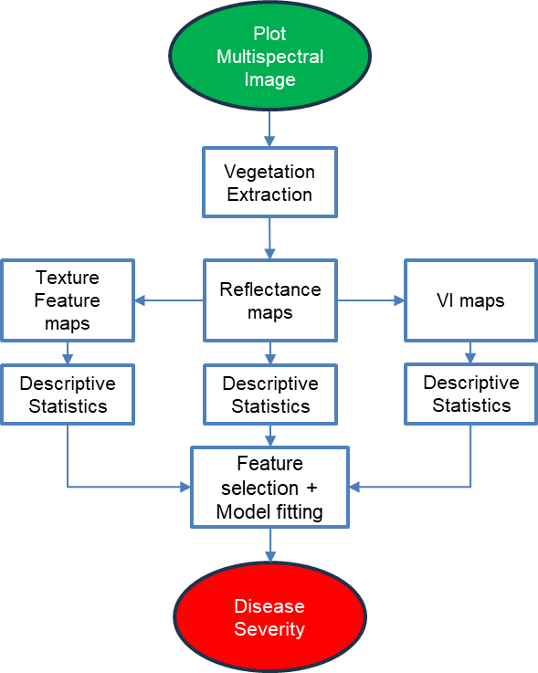

<div align="center">

# Disease severity estimation from multispectral data of Table Beets

<!-- Python Version Badge -->
[](https://python.org)

</div>

## **Overview**
Code for the processing of multispectral data to obtain cercospora leaf spot disease severity.
<p align="center">
  
</p>

## **Installation**
### Prerequisites
- Python 3.9
- Conda
### Steps
- Clone/download the repository 
- Set up and activate the environment 
- Download the [dataset](https://data.mendeley.com/preview/v9b7rwrwx9?a=01237083-094e-4fa6-bf1e-8c5829e14e64) in the directory
```shell
# Downloading the directory
git clone git@github.com:saif8091/cls_multispec_uas.git
cd cls_multispec_uas

# Setting up environment
conda env create -f environment.yml python=3.9
conda activate cls_multispec
```
**Note**: The data should be downloaded and placed as data directory in the project root. Look [here](#project-structure) for detailed directory structure.

## **Preprocessing and feature generation**
Run the following code:
```shell
python make.py
```
This code performs the required preprocessing and organises the data into predict and target variable form with train, validation and test split.

Please refer to the following [notebook](preprocess/vis.ipynb) for visualisation of each images and features.

## **Feature selection and model optimization**
```shell
python filter.py
python score.py
```
The first code snippet performs three types of feature filturing and the filtered feature can be found [here.](feat_filter/filtered_features).
The second code generates model scores at different feature and hyperparameter combinations for random forest, xtreme gradient boosting, support vector and partial least square regression models. The scores can be found [here.](mod_opt/model_scores)

## **Results**
Detailed result analysis can be found [here.](results.ipynb)

<br>

## **Project Structure**

The directory structure of new project looks like this:

```
├───data                            <- All raw and preprocessed data will be stored here
│   ├───multispec_2021_2022             <- 2021/2022 raw images
│   ├───multispec_2023                  <- 2023 raw images
│   └───CLS_DS.csv                      <- Field assessed disease severity
│
├───feat_filter                     <- Directory containing all feature filter code and filtured features
│   ├───filtered_features               <- Directory containing filtered features
│   ├───feat_filter_cfs.py              <- Code for correlation based feature filter
│   ├───feat_filter_mfs.py              <- Code for MI based feature filter
│   └───feat_filter_micorfs.py          <- Code for correlation and MI based feature filter
│
├───figures                         <- Directory containing figures
│
├───mod_opt                         <- Directory for model optimization
│   ├───model_scores                    <- Directory containing all model scores
│   ├───data_load.py                    <- Data loading code for model optimization
│   ├───plsr.py                         <- Partial least square regression code
│   ├───rf.py                           <- Random forest regression code
│   ├───svr.py                          <- Support vector regression code
│   └───xgb.py                          <- Xtreme gradient boosting code
│   
├───preprocess                      <- Directory containing code for preprocessing and feature generation
|   ├───cls_interp.py                   <- Code for CLS interpolation
|   ├───feat_split.py                   <- Code for train/val/test split
|   ├───gen_feat.py                     <- Code for generating features
|   ├───clear
|   ├───gen_veg_im.py                   <- Code for vegetation extraction
|   ├───vis.ipynb                       <- Notebook for visualisation
|   └───zip_im.py                       <- Zipping all raw multispectral images into single dictionary
|
├───src                             <- Directory containing all the required functions 
|
├───.gitignore
├───environment.yml                 
├───filter.py                       <- Run for feature filtration
├───make.py                         <- Run for preprocessing and feature generation
├───README.md
├───results.ipynb                   <- Notebook for detailed feature visualisation
└───score.py                        <- Run to optimize model
```
<br>

## **Resources**
- [Gray Level Co-Occurrence Matrix calculation code](https://github.com/tzm030329/GLCM)